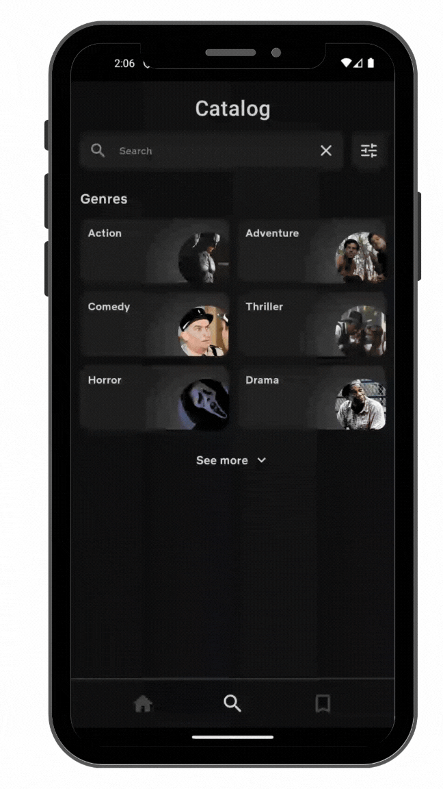

# MovieApp 

## O projekcie

**MovieApp** to intuicyjna i łatwa w obsłudze aplikacja filmowo-serialowa.  
Niezależnie od tego, czy szukasz czegoś na wieczór, czy chcesz uporządkować swoją listę *"do obejrzenia"*, ta aplikacja Ci w tym pomoże.

## Funkcje

- **Odkrywaj**: Przeglądaj tysiące filmów z różnych gatunków i lat.  
- **Wyszukiwarka**: Znajdź interesujący Cię film w kilka sekund.  
- **Twoja lista**: Twórz własną, spersonalizowaną listę filmów, które chcesz obejrzeć.  
- **Szczegóły**: Uzyskaj dostęp do szczegółowych informacji o każdym filmie – opisy, obsada, zwiastuny.  

## Technologie 💻

Aplikacja została zbudowana przy użyciu nowoczesnych technologii, aby zapewnić najlepsze wrażenia z użytkowania:

- **Kotlin** – zwięzły i bezpieczny język programowania.
- **Jetpack Compose** – nowoczesny framework do budowania UI w Androidzie.
- **Retrofit** – biblioteka do komunikacji z API.
- **Room** – warstwa abstrakcji nad SQLite do lokalnego przechowywania danych.
- **Dagger Hilt** – do wstrzykiwania zależności w prosty sposób.

---

## Zrzuty ekranu 📸

  
  
  
  
  
  
  
  

---

## GIF z działaniem aplikacji 🎥

  

---
